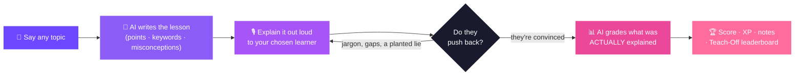
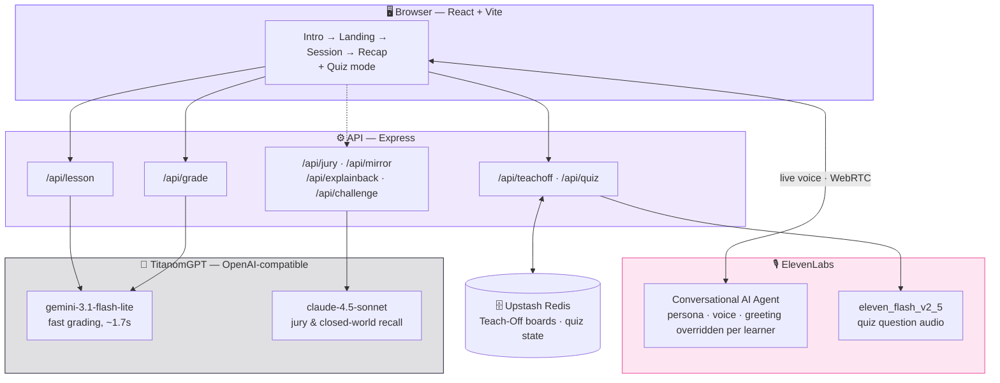

<div align="center">


[](https://titanom-hackathon-8xts.vercel.app/)

[](https://hack.titanom.com/)

*3 months of ElevenLabs Scale · for the best project built with ElevenLabs*


</div>

<br/>

> [!IMPORTANT]
> The hackathon's own API key has since been archived by the provider, so the live
> demo cannot generate lessons on its own. It now asks visitors to paste their own
> TitanomGPT key, which stays in that browser tab and is **never stored
> server-side**. See [Bring your own key](#bring-your-own-key).

<br/>

## Table of contents

- [What is this](#what-is-this)
- [The loop](#the-loop)
- [Meet the six learners](#meet-the-six-learners)
- [Under the hood](#under-the-hood)
- [Why this model](#why-this-model)
- [Side modes](#side-modes)
- [Running it locally](#running-it-locally)
- [Bring your own key](#bring-your-own-key)
- [Deploying](#deploying)
- [Feature flags](#feature-flags)
- [Themes and accessibility](#themes-and-accessibility)
- [The team and the hackathon](#the-team-and-the-hackathon)

<br/>

## What is this

Everyone knows the Feynman technique: if you can't explain something simply, you
don't really understand it. Every app that claims to teach it asks you to *type* an
explanation and pattern-matches it against a rubric.

**Teach It To Grandma makes you say it out loud, to someone who can push back.**

Pick any topic. An AI learner — voice, personality and all — listens live and asks
the questions a real beginner would ask: *"but what does that word mean, darling?"*,
*"how did you get from that to this?"* They occasionally state something confidently
wrong, just to see whether you catch it. When you're done, a separate grading pass
reads the whole conversation and judges whether each point was **genuinely
explained**, not just name-dropped.

> The moment this app is built around: the keyword bar reads 4 / 4, and the learner
> says she didn't follow a word of it. **That gap is the entire product.**

<br/>

## The loop



<br/>

## Meet the six learners

One ElevenLabs agent, six personas — each with its own voice, vocabulary, question
style and **grading strictness**. All six share one unbreakable rule: they are the
learner, never the teacher. They will never define a term for you.

<div align="center">

| | | | | | |
|:---:|:---:|:---:|:---:|:---:|:---:|
|  |  |  |  |  |  |
| **Grandma** | **Mia**, 7 | **Sam** | **Marcus** | **Victor** | **Prof. Ellis** |
| Knows nothing.<br/>Loves you anyway. | Asks *why*.<br/>Then asks again. | Knows the words,<br/>not the how. | Wants the<br/>bottom line. | Knows the field<br/>next door. | Remembers<br/>everything you said. |
| Beginner | Beginner | Intermediate | Intermediate | Advanced | Advanced |

</div>

The same explanation lands differently for each. **That gap is the result.**

<br/>

## Under the hood



Two things shape every design decision here:

- **Grading never blocks the demo.** If the AI grader is slow or fails, the recap
  still renders from the live in-browser keyword check — a worse verdict, never a
  stuck screen.
- **The score is computed, never model-emitted.** The AI answers yes/no per point
  with reasoning; the headline number is arithmetic over those booleans, so it's
  reproducible and every input is something an engineer can point at.

<br/>

## Why this model

`gemini-3.1-flash-lite` does the graded work, chosen by measurement rather than
reputation:

| Model | Jargon-stuffed answer | Genuinely good answer | Verdict |
|---|:---:|:---:|---|
| **gemini-3.1-flash-lite** | 1 / 4 | 4 / 4 | ✅ kept — ~1.7s |
| claude-4.5-haiku | 3 / 4 | — | ❌ rubber-stamps jargon |
| gpt-5.4-mini | 4 / 4 | — | ❌ rubber-stamps jargon |

Four runs each. **A grader that rubber-stamps jargon destroys the one thing this
product claims.** Judgement-heavy work — the jury's distinct personas, closed-world
recall — stays on `claude-4.5-sonnet`.

<br/>

## Side modes

**🎓 Teach-Off** — several people teach the *same stored lesson* and land on one
board. Codes are shareable across devices, backed by Upstash Redis.

**⚡ Two-player quiz** — deliberately a *different* measurement, and deliberately not
the headline: fifteen generated questions, both players hear each one read aloud and
race to tap. Scores stay hidden until the end, because being told the answer
immediately teaches nothing.

> The quiz is worth reading for its timing model. **Nothing runs a timer.** A
> serverless function exists only for the length of a request, so the game's position
> is *derived* from two timestamps and the clock, recomputed identically on every
> request. Two devices agree because they read the same arithmetic — not because
> messages arrived on time.

<br/>

## Running it locally

```bash
# terminal 1 — API
cd server
npm install
npm run dev        # http://localhost:3001

# terminal 2 — frontend
cd frontend
npm install
npm run dev        # http://localhost:5173
```

Create a project-root `.env` (gitignored):

```bash
TITANOM_API_KEY=sk_...      # DeutschlandGPT — lessons, grading, quiz questions
ELEVENLABS_API_KEY=sk_...   # voice + quiz audio
```

`./smoke-test.sh` checks both processes and the grading endpoint before a demo.

> [!NOTE]
> Locally the app runs on a JSON file rather than Redis. That's dev-only: a deployed
> build **refuses to boot** without Redis rather than half-working, since a
> file-backed board only succeeds when two requests happen to hit the same warm
> instance. Check `/health` — it reports which store is live.

<br/>

## Bring your own key

A visitor can supply their own TitanomGPT key when the deploy's key is dead. The
rules that make that reasonable to ask are all about **not keeping it**:

| | |
|---|---|
| 🔑 Travels on | one request header |
| ⏱️ Lives for | the length of a single call |
| 🚫 Never | logged, persisted, echoed back, or cached |
| 🗑️ In the browser | `sessionStorage` — dies with the tab |

A cache keyed on a secret is a store of secrets, so the client is built per request
and thrown away with it.

<br/>

## Deploying

Two Vercel projects from this one repo, so each half gets zero-config detection —
Vite on one side, Express on the other, no `vercel.json`.

| Project | Root Directory | Environment |
|---|---|---|
| Frontend | `frontend` | `VITE_GRADING_API` |
| API | `server` | `TITANOM_API_KEY`, `ELEVENLABS_API_KEY`, `ALLOWED_ORIGIN`, Upstash |

Full walkthrough, including the CORS loop and how to roll back mid-demo, is in
**[DEPLOY.md](DEPLOY.md)**.

<br/>

## Feature flags

Everything beyond the core loop sits behind a flag in `frontend/src/features.js`,
switchable from the URL without touching code:

```
?off=aiJury                turn one feature off
?off=aiJury,achievements   turn several off
?safe                      turn EVERYTHING optional off
```

The core loop is deliberately unflagged. It *is* the demo; if it breaks, flags won't
save it.

<br/>

## Themes and accessibility

Light and dark, user-selectable, with light as the default so a first-time visitor
sees what was designed. Every colour resolves through a token — no colour literals
remain in `App.css` or `quiz.css` — and both themes are verified by a contrast audit
across the landing page, the teaching flow and every quiz screen.

<br/>

## The team and the hackathon

<div align="center">

**Student Hackathon 2026** · Titanom Solutions × DeutschlandGPT · Germering
14–15 August 2026 · 6 teams · Theme: Education × AI

**Team Epoch One** — built in roughly 30 hours

</div>

| | |
|---|---|
| **[Pavin Sumathi Palanichamy](https://github.com/PavinSP)** | Implementation — frontend, API, voice integration, quiz engine, deployment |
| **Prethebha Muthukumaran** | Feature direction and testing — shaped what this became, and kept finding what was missed |

<div align="center">
<br/>

🏆 **Winner — ElevenLabs Sonderpreis, Best Project Built With ElevenLabs**

*Awarded for the six characters: distinct voices, distinct personalities,
and six different ways of not understanding you.*

</div>
